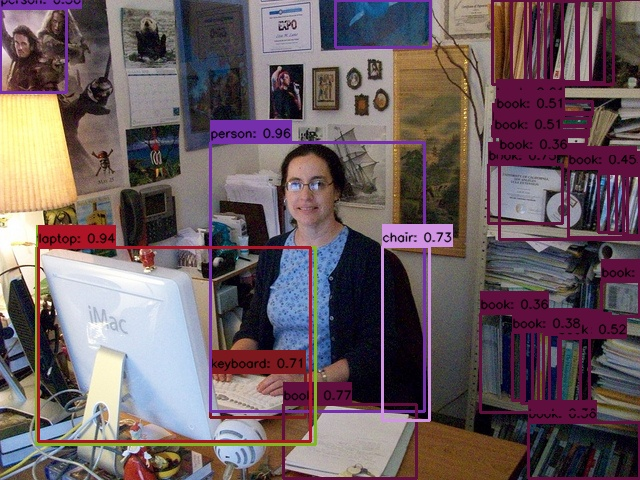
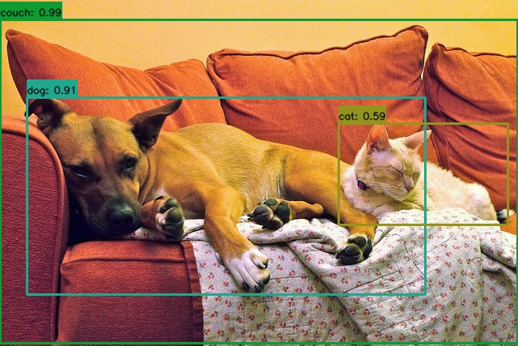
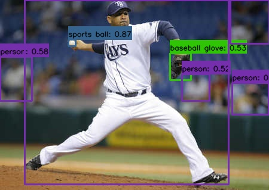
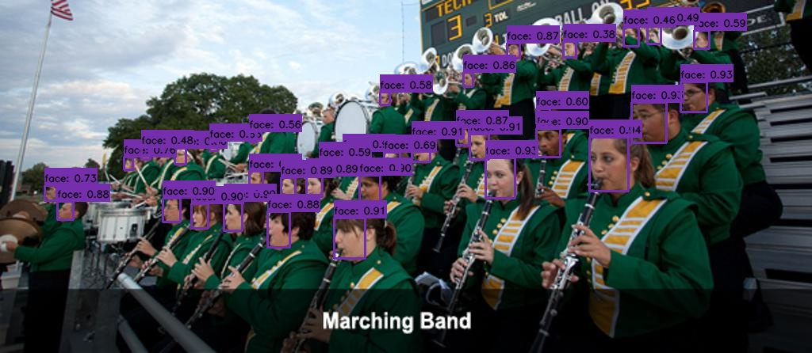
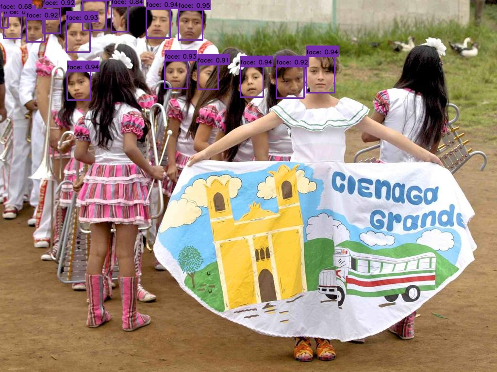
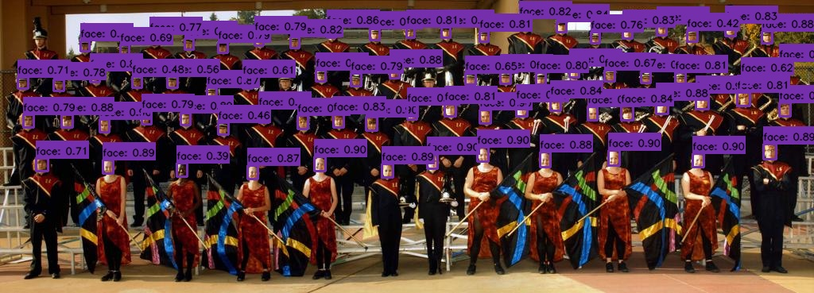
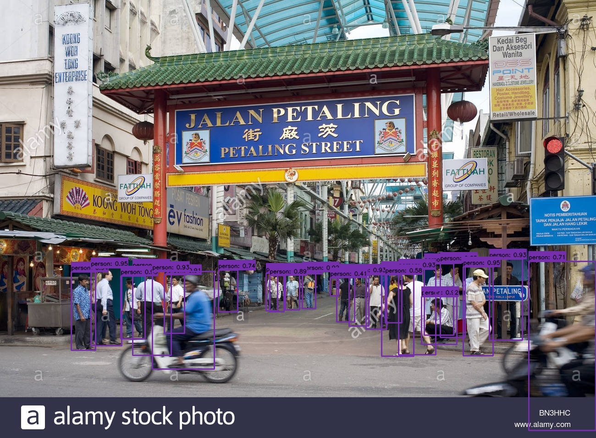
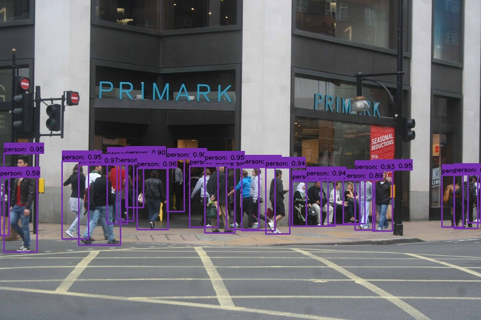
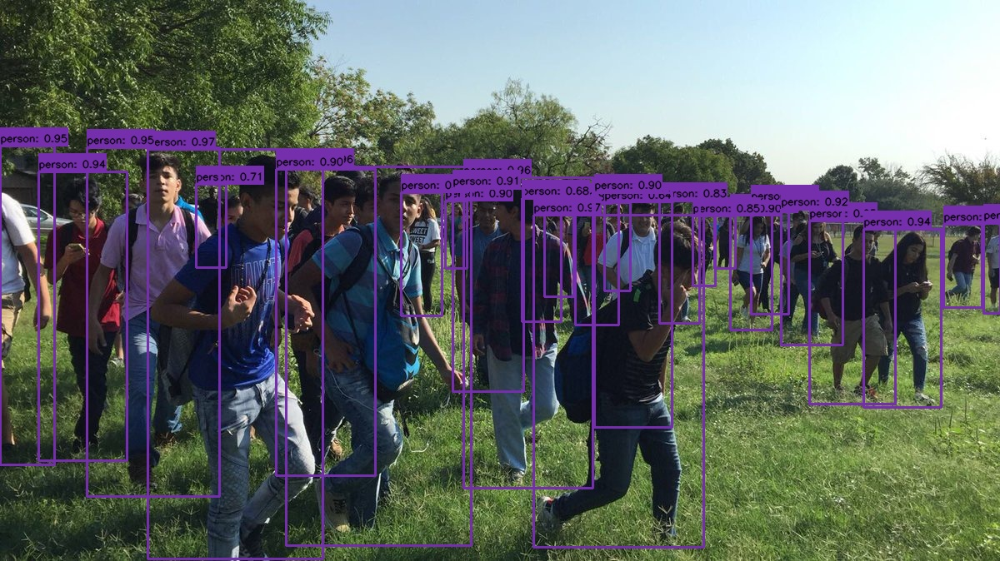

# FreeYOLO
FreeYOLO is inspired by many other excellent works, such as [YOLOv7](https://github.com/WongKinYiu/yolov7) and [YOLOX](https://github.com/Megvii-BaseDetection/YOLOX). Achieving the SOTA performance is not my purpose, which requires much computing resource. I just believe Mr. Feynman's famous saying: Learning by doing. I will never understand the YOLO detector until I achieve it.

I have tried my best to design FreeYOLO. Although there is still much room for improvement, my few GPU devices are not enough to support me to continue to optimize it, which is a pity for me.

Nevertheless, in this project, you will enjoy:
* FreeYOLO on COCO for general object detection.
* FreeYOLO on WiderFace for face detection.
* FreeYOLO on CrowdHuman for person detection.

Besides the detection task, I also apply FreeYOLO to the multi-object tracking task.
* [FreeTrack](https://github.com/yjh0410/FreeTrack)

My FreeTrack consists of the FreeYOLO object detector and [ByteTrack](https://github.com/ifzhang/ByteTrack) tracker. Note that my FreeTrack is
just a A+B work, so it is not novel.

# Requirements
- We recommend you to use Anaconda to create a conda environment:
```Shell
conda create -n yolo python=3.6
```

- Then, activate the environment:
```Shell
conda activate yolo
```

- Requirements:
```Shell
pip install -r requirements.txt 
```

My environment:
- PyTorch = 1.9.1
- Torchvision = 0.10.1

At least, please make sure your torch is version 1.x.

# Tricks
- [x] [Mosaic Augmentation](https://github.com/yjh0410/FreeYOLO/blob/master/dataset/transforms.py)
- [x] [Mixup Augmentation](https://github.com/yjh0410/FreeYOLO/blob/master/dataset/transforms.py)
- [x] Multi scale training
- [x] Cosine Annealing Schedule

# Training Configuration
|   Configuration         |                      |
|-------------------------|----------------------|
| Batch Size (bs)         | 16                   |
| Init Lr                 | 0.01/64 × bs         |
| Lr Scheduler            | Cos                  |
| Optimizer               | SGD                  |
| ImageNet Predtrained    | True                 |
| Multi Scale Train       | True                 |
| Mosaic                  | True                 |
| Mixup                   | True                 |


# Experiments
## COCO
- Download COCO.
```Shell
cd <FreeYOLO_HOME>
cd dataset/scripts/
sh COCO2017.sh
```

- Check COCO
```Shell
cd <FreeYOLO_HOME>
python dataset/coco.py
```

- Train on COCO

For example:
```Shell
python train.py --cuda -d coco -v yolo_free_nano -bs 16 -accu 4 --max_epoch 300 --wp_epoch 1 --eval_epoch 10 --fp16 --ema --root path/to/COCO
```

Main results on COCO-val:

| Model          |  Scale  | FPS<sup><br>2080ti |  FLOPs   |  Params  |    AP    |    AP50    |  Weight  |
|----------------|---------|--------------------|----------|----------|----------|------------|----------|
| FreeYOLO-Nano  |  640    |                    |   4.6 G  |  2.0 M   |   30.5   |    50.3    | [github](https://github.com/yjh0410/FreeYOLO/releases/download/weight/yolo_free_nano_coco.pth) |
| FreeYOLO-Tiny  |  640    |                    |   13.9 G |  6.2 M   |   34.4   |    53.9    | [github](https://github.com/yjh0410/FreeYOLO/releases/download/weight/yolo_free_tiny_coco.pth) |
| FreeYOLO-Large |  640    |                    |  144.8 G |  44.1 M  |   48.6   |    68.5    | [github](https://github.com/yjh0410/FreeYOLO/releases/download/weight/yolo_free_large_coco.pth) |
| FreeYOLO-Huge  |  640    |                    |  257.8 G |  78.9 M  |   50.0   |    69.5    | [github](https://github.com/yjh0410/FreeYOLO/releases/download/weight/yolo_free_huge_coco.pth) |








## WiderFace
- Download [WiderFace](http://shuoyang1213.me/WIDERFACE/).

- Prepare WiderFace
```
WiderFace
|_ WIDER_train
|  |_ images
|     |_ 0--Parade
|     |_ ...
|_ WIDER_tval
|  |_ images
|     |_ 0--Parade
|     |_ ...
|_ wider_face_split
|_ eval_tools
```

- Convert WiderFace to COCO format.
```Shell
cd <FreeYOLO_HOME>
python tools/convert_widerface_to_coco.py --root path/to/WiderFace
```

- Check WiderFace
```Shell
cd <FreeYOLO_HOME>
python dataset/widerface.py
```

- Train on WiderFace
For example:
```Shell
python train.py --cuda -d widerface --root path/to/WiderFace -v yolo_free_nano -bs 16 -accu 4 -lr 0.001 -mlr 0.05 --max_epoch 100 --wp_epoch 1 --eval_epoch 10 --fp16 --ema --pretrained path/to/coco/yolo_free_nano_ckpt --mosaic 0.5 --mixup 0.0 --min_box_size 1
```

Main results on WiderFace-val:

| Model          |  Scale  |    AP    |    AP50    |  Weight  |
|----------------|---------|----------|------------|----------|
| FreeYOLO-Nano  |  640    |   26.4   |   51.6     | [github](https://github.com/yjh0410/FreeYOLO/releases/download/weight/yolo_free_nano_wf.pth) |
| FreeYOLO-Tiny  |  640    |   30.1   |   57.4     | [github](https://github.com/yjh0410/FreeYOLO/releases/download/weight/yolo_free_tiny_wf.pth) |
| FreeYOLO-Large |  640    |   35.7   |   64.6     | [github](https://github.com/yjh0410/FreeYOLO/releases/download/weight/yolo_free_large_wf.pth) |
| FreeYOLO-Huge  |  640    |      |        |  |






## CrowdHuman
- Download [CrowdHuman](https://www.crowdhuman.org/).
```
CrowdHuman
|_ CrowdHuman_train01.zip
|_ CrowdHuman_train02.zip
|_ CrowdHuman_train03.zip
|_ CrowdHuman_val.zip
|_ annotation_train.odgt
|_ annotation_val.odgt
```

- Prepare CrowdHuman
```
CrowdHuman
|_ CrowdHuman_train
|  |_ Images
|     |_ 273271,1a0d6000b9e1f5b7.jpg
|     |_ ...
|_ CrowdHuman_val
|  |_ Images
|     |_ 273271,1b9330008da38cd6.jpg
|     |_ ...
|_ annotation_train.odgt
|_ annotation_val.odgt
```

- Convert CrowdHuman to COCO format.
```Shell
cd <FreeYOLO_HOME>
python tools/convert_crowdhuman_to_coco.py --root path/to/CrowdHuman
```

- Check CrowdHuman
```Shell
cd <FreeYOLO_HOME>
python dataset/crowdhuman.py
```

- Train on CrowdHuman
For example:
```Shell
python train.py --cuda -d crowdhuman -v yolo_free_nano -bs 16 -accu 4 -lr 0.001 -mlr 0.05 --max_epoch 100 --wp_epoch 1 --eval_epoch 10 --fp16 --ema --root path/to/CrowdHuman --pretrained path/to/coco/yolo_free_nano_ckpt
```

Main results on CrowdHuman-val:

| Model          |  Scale  |    AP    |    AP50    |  Weight  |
|----------------|---------|----------|------------|----------|
| FreeYOLO-Nano  |  640    |   31.3   |   67.2     | [github](https://github.com/yjh0410/FreeYOLO/releases/download/weight/yolo_free_nano_ch.pth) |
| FreeYOLO-Tiny  |  640    |   34.7   |   70.4     | [github](https://github.com/yjh0410/FreeYOLO/releases/download/weight/yolo_free_tiny_ch.pth) |
| FreeYOLO-Large |  640    |   43.1   |   76.5     | [github](https://github.com/yjh0410/FreeYOLO/releases/download/weight/yolo_free_large_ch.pth) |
| FreeYOLO-Huge  |  640    |      |        |  |






## MOT17
- Download [MOT17](https://motchallenge.net/), then you will get a ```MOT17.zip` file.

- Prepare MOT17
```
MOT17
|_ train
|  |_ MOT17-02-DPM
|     |_ det
|     |_ gt
|     |_ img1
|     |_ ...
|  ...
|_ test
|  |_ MOT17-01-DPM
|     |_ det
|     |_ img1
|     |_ ...
|  ...
```

- Convert MOT17 to COCO format.
```Shell
cd <FreeYOLO_HOME>
python tools/convert_mot17_to_coco.py --root path/to/MOT17
```

- Check MOT17
```Shell
cd <FreeYOLO_HOME>
python dataset/mot17.py
```

- Train on MOT17 half

For example:
```Shell
python train.py --cuda -d mot17_half -v yolo_free_nano -bs 16 -accu 4 --max_epoch 100 --wp_epoch 1 --eval_epoch 10 --fp16 --ema --root path/to/MOT17 --pretrained path/to/coco/yolo_free_nano_ckpt
```

Main results on MOT17 val-half (trained on MOT17 train-half):

| Model          |  Scale  |    AP    |    AP50    |  Weight  |
|----------------|---------|----------|------------|----------|
| FreeYOLO-Nano  |  640    |      |        |  |
| FreeYOLO-Tiny  |  640    |      |        |  |
| FreeYOLO-Large |  640    |      |        |  |
| FreeYOLO-Huge  |  640    |      |        |  |

- Train on MOT17

For example:
```Shell
python train.py --cuda -d mot17 -v yolo_free_nano -bs 16 -accu 4 --max_epoch 100 --wp_epoch 1 --fp16 --ema --root path/to/MOT17 --pretrained path/to/coco/yolo_free_nano_ckpt
```

Pretrained weights on MOT17 train split (fully train, not train-half):

[FreeYOLO-Nano]()

[FreeYOLO-Tiny]()

[FreeYOLO-Large]()

[FreeYOLO-Huge]()


## MOT20
- Download [MOT20](https://motchallenge.net/), then you will get a ```MOT20.zip` file.

- Prepare MOT20
Similar to MOT17

- Convert MOT20 to COCO format.
```Shell
cd <FreeYOLO_HOME>
python tools/convert_mot20_to_coco.py --root path/to/MOT20
```

- Check MOT20
```Shell
cd <FreeYOLO_HOME>
python dataset/mot20.py
```

- Train on MOT20 half

For example:
```Shell
python train.py --cuda -d mot20_half -v yolo_free_nano -bs 16 --max_epoch 100 --wp_epoch 1 --eval_epoch 10 --fp16 --ema --root path/to/MOT20 --pretrained path/to/coco/yolo_free_nano_ckpt
```

Main results on MOT20 val-half (trained on MOT20 train-half):

| Model          |  Scale  |    AP    |    AP50    |  Weight  |
|----------------|---------|----------|------------|----------|
| FreeYOLO-Nano  |  640    |      |        |  |
| FreeYOLO-Tiny  |  640    |      |        |  |
| FreeYOLO-Large |  640    |      |        |  |
| FreeYOLO-Huge  |  640    |      |        |  |

- Train on MOT20

For example:
```Shell
python train.py --cuda -d mot20 -v yolo_free_nano -bs 16 --max_epoch 100 --wp_epoch 1 -- eval_epoch 10 --fp16 --ema --root path/to/MOT20 --pretrained path/to/coco/yolo_free_nano_ckpt
```

Pretrained weights on MOT20 train split (fully train, not train-half):

[FreeYOLO-Nano]()

[FreeYOLO-Tiny]()

[FreeYOLO-Large]()

[FreeYOLO-Huge]()

# Train
## Single GPU
```Shell
sh train.sh
```

You can change the configurations of `train.sh`, according to your own situation.

## Multi GPUs
```Shell
sh train_ddp.sh
```

You can change the configurations of `train_ddp.sh`, according to your own situation.

**In the event of a training interruption**, you can pass `--resume` the latest training
weight path (`None` by default) to resume training. For example:

```Shell
python train.py \
        --cuda \
        -d coco \
        -v yolo_free_large \
        --ema \
        --fp16 \
        --eval_epoch 10 \
        --resume weights/coco/yolo_free_large/yolo_free_large_epoch_151_39.24.pth
```

Then, training will continue from 151 epoch.

# Test
```Shell
python test.py -d coco \
               --cuda \
               -v yolo_free_large \
               --img_size 640 \
               --weight path/to/weight \
               --root path/to/dataset/ \
               --show
```

# Evaluation
```Shell
python eval.py -d coco-val \
               --cuda \
               -v yolo_free_large \
               --img_size 640 \
               --weight path/to/weight \
               --root path/to/dataset/ \
               --show
```

# Demo
I have provide some images in `data/demo/images/`, so you can run following command to run a demo:

```Shell
python demo.py --mode image \
               --path_to_img data/demo/images/ \
               -v yolo_free_large \
               --img_size 640 \
               --cuda \
               --weight path/to/weight
```

If you want run a demo of streaming video detection, you need to set `--mode` to `video`, and give the path to video `--path_to_vid`。

```Shell
python demo.py --mode video \
               --path_to_img data/demo/videos/your_video \
               -v yolo_free_large \
               --img_size 640 \
               --cuda \
               --weight path/to/weight
```

If you want run video detection with your camera, you need to set `--mode` to `camera`。

```Shell
python demo.py --mode camera \
               -v yolo_free_large \
               --img_size 640 \
               --cuda \
               --weight path/to/weight
```

# Deployment
1. [ONNX export and an ONNXRuntime](./deployment/ONNXRuntime/)
2. [OpenVINO in C++ and Python](./deployment/OpenVINO)